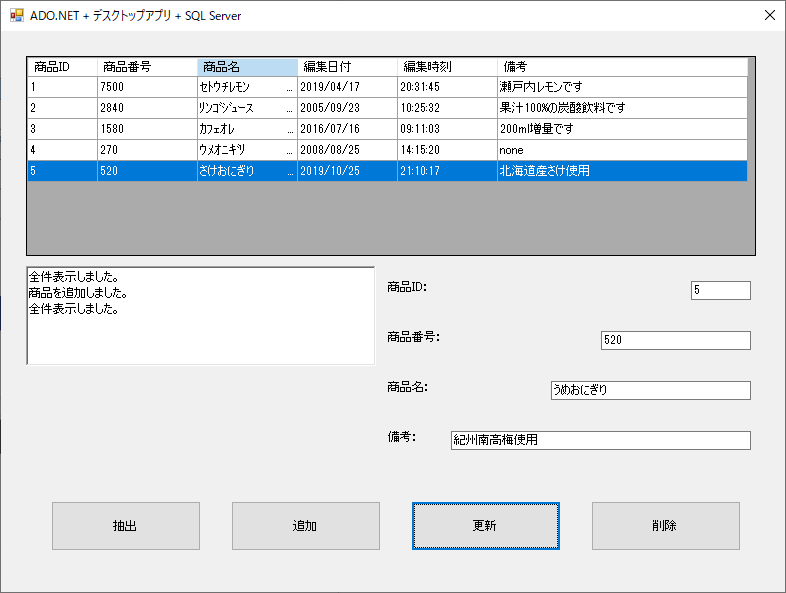

## :computer: Windows FormsでEntityFrameworkを使いSQLServerとの読み書きサンプル  
___
### 環境
```
開発環境：Microsoft Visual Studio 2019 Community Edition 16.7.2  
言語：Visual Basic .NET 16.0  
デスクトップ：Windows Formsアプリケーション
デベロッパーSDK：.NET Framework 4.8 SDK  
データベース：Microsoft SQLServer 2019 Express CU7  
-データベース管理ツール：Microsoft SQL Server Management Studio 18.6  
データベース接続：.NET Framework Data Provider for SQL Server  
O/R マッピング フレームワーク：Entity Framework 6.4.4
```
  

## 事前準備  
### サンプルプログラムを実行する際のデータベース作成、テーブル作成およびサンプルデータ  
Entity Frameworkの機能および設定によりデータベースおよびテーブルが無ければ作成しますので必要ありません。  
作成時には数秒～数十秒ほど時間がかかります。  
サンプルデータもプログラムでデータが１件も無ければ作成する様になっていますので必要ありません。  

___